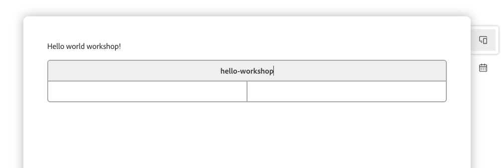

# ChatGPT Apps tutorial for AEM sites

## Introduction

This tutorial introduces you to the **LLM Conversion Bridge**, a powerful framework for building ChatGPT applications that integrate seamlessly with Adobe Experience Manager (AEM) sites. The bridge enables you to create interactive AI-powered experiences by connecting Large Language Models (LLMs) like ChatGPT with your AEM content through the Model Context Protocol (MCP).

### What is LLM Conversion Bridge?

The LLM Conversion Bridge is a production-ready boilerplate project that runs on **Fastly Compute@Edge**, providing:
- **MCP Server Implementation**: Standards-based protocol for LLM action integration
- **Action System**: Modular, auto-discovered actions that LLMs can invoke
- **AEM Widget Framework**: Rich, interactive UI components that display in chat conversations
- **AEM Integration**: Native support for AEM Edge Delivery Services (EDS) content

### Benefits

1. **Scaffolding Tools**: Generate new actions and AEM widgets using command-line tools
2. **AEM Content Integration**: Use your existing AEM content and AEM widgets in AI conversations
3. **Production-Ready**: Includes IMS authentication, Fastly Secret Store, and session management
4. **Edge Deployment**: Runs on Fastly Compute@Edge infrastructure
5. **Modular Architecture**: Easy to customize and extend for your use cases

### What You'll Learn

This hands-on workshop teaches you how to:
- Set up an AEM Edge Delivery Services (EDS) environment
- Create interactive AEM widgets that display rich content
- Build ChatGPT actions that invoke these AEM widgets
- Deploy and test your application in production

By the end of this tutorial, you'll have a fully functional ChatGPT app that displays AEM content in response to natural language queries.

## Overview

Learn how to create an action that displays content using an AEM widget built with AEM Edge Delivery Services (EDS). By the end of this workshop, you'll have a fully functional action that can be invoked by LLMs to display rich, interactive content.

## What You'll Build

You'll create a "Team Dashboard" action that displays team information in a beautifully styled AEM widget. The AEM widget will be authored in EDS and embedded into the MCP server.

---

## Table of Contents

- [Part 1: EDS Environment Setup](#part-1-eds-environment-setup)
  - [Step 1.1: Create Your EDS Project](#step-11-create-your-eds-project)
  - [Step 1.2: Test Your EDS Environment](#step-12-test-your-eds-environment)
- [Part 2: Setup CORS](#part-2-setup-cors)
- [Part 3: AEM Embed Setup](#part-3-aem-embed-setup)
  - [Step 3.1: Add the AEM Embed Script](#step-31-add-the-aem-embed-script)
  - [Step 3.2: Test AEM Embed (Optional)](#step-32-test-aem-embed-optional)
- [Part 4: Create Widget Content in EDS](#part-4-create-widget-content-in-eds)
  - [Step 4.1: Create the Widget Page](#step-41-create-the-widget-page)
- [Part 5: Create the Action with Widget](#part-5-create-the-action-with-widget)
  - [Step 5.1: Generate the Action Scaffold](#step-51-generate-the-action-scaffold)
  - [Step 5.2: Update the Widget Template](#step-52-update-the-widget-template)
  - [Step 5.3: Update the Widget Metadata](#step-53-update-the-widget-metadata)
  - [Step 5.4: Update the Action Handler](#step-54-update-the-action-handler)
- [Part 6: Build and Test](#part-6-build-and-test)
  - [Step 6.1: Build the Project](#step-61-build-the-project)
  - [Step 6.2: Run Tests](#step-62-run-tests)
  - [Step 6.3: Local Development Testing](#step-63-local-development-testing)
- [Part 7: Deploy and Verify](#part-7-deploy-and-verify)
  - [Step 7.1: Deploy to Fastly](#step-71-deploy-to-fastly)
  - [Step 7.2: Test in Production](#step-72-test-in-production)

---

## Part 1: EDS Environment Setup

### Step 1.1: Create Your EDS Project

1. **Navigate to the EDS Tutorial**
   - Go to https://www.aem.live/developer/tutorial
   - This will guide you through the complete EDS setup or create one new EDS site from Cloud Manager - https://experienceleague.adobe.com/en/docs/experience-manager-cloud-service/content/implementing/using-cloud-manager/edge-delivery-sites/create-edge-delivery-site

2. **Verify Your Setup**
   - You should now have:
     - A GitHub repository with the EDS boilerplate code
     - A preview URL (e.g., `https://main--my-aem-widgets--yourusername.aem.live`)
     - A local development environment (optional but recommended)

### Step 1.2: Test Your EDS Environment

1. **Access Your Live Site**
   ```
   https://main--my-aem-widgets--yourusername.aem.live
   ```

2. **Preview the Changes**
   - Wait a few seconds for the build to complete
   - Refresh your preview URL
   - You should see your changes reflected

---

## Part 2: Setup CORS
Navigate to https://labs.aem.live/tools/headers-edit/index.html. Make sure you are signed in.
Select your organization and repo.
Click `Fetch`.
Add the following header:
```access-control-allow-origin: *```
Click Save.

## Part 3: AEM Embed Setup

AEM Embed allows you to display EDS content inside non-EDS environments (like widgets to display in chatgpt user conversations).

### Step 3.1: Add the AEM Embed Script

1. **Checkout the example setup commit**
   Follow the sample commit: https://github.com/LucianRadu/chatgpt-eds/commit/3ca34d66958bac8c2e4a4bda08930f1e7bb817f5

   

2. **Commit and Push**
  Commit and push your changes

3. **Verify the Script is Available**
   - Wait for the deployment
   - Access: `https://main--my-aem-widgets--yourusername.aem.live/scripts/aem-embed.js`
   - You should see your JavaScript code

### Step 3.2: Test AEM Embed (Optional)

Create a test page to verify AEM Embed works:

1. **Create `test-embed.html` in your local EDS project:**
   ```html
   <!DOCTYPE html>
   <html>
   <head>
       <title>AEM Embed Test</title>
   </head>
   <body>
       <h1>Testing AEM Embed</h1>
       <script src="/scripts/aem-embed.js" type="module"></script>
       <aem-embed url="/"></aem-embed>
   </body>
   </html>
   ```
2. **Start local server**
   ```bash
   npm install
   aem up
   ```
3. **Test it at:**
   ```
   https://localhost:${LCB_UI_BACKEND_PORT}/test-embed.html
   ```

---

## Part 4: Create Widget Content in EDS

Now let's create the actual content that will be displayed in your widget.

### Step 4.1: Create the Widget Page

1. **Create a New Document**
   
   In your EDS authoring environment (https://da.live/#/organization/repository) , create a new file:
   - Path: `widgets/hello-workshop` 

2. **Add the Widget Content**


3. **Preview and Publish**

4. **Create an EDS block for hello-workshop**

   Under `/blocks` create:
   - `/blocks/hello-workshop/hello-workshop.js`
   - `/blocks/hello-workshop/hello-workshop.css`

Add the following in `/blocks/hello-workshop/hello-workshop.js`

```javascript
export default async function decorate(block, onDataLoaded) {
  block.textContent = 'Content loading...';
  onDataLoaded.then((data) => {
    // eslint-disable-next-line no-console
    console.log('Data loaded', data);
    block.textContent = 'Data loaded';
  });
}

```

5. **Commit and Verify**
   ```bash
   git add .
   git commit -m "Add widget content"
   git push
   ```

6. **Preview Your Widget**
   ```
   https://main--my-aem-widgets--yourusername.aem.live/widgets/hello-workshop
   ```
  

---

## Part 5: Create the Action with Widget

Now we'll integrate the EDS widget previously create into an action.

### Step 5.1: Generate the Action Scaffold

1. **Navigate to Your Project**
   ```bash
   cd /path/to/lcb-server
   ```

2. **Generate the Action with Widget**
   ```bash
   make create-action NAME=helloWorkshop WIDGET=true
   ```

   This creates:
   ```
   server/src/actions/helloWorkshop/
   ├── index.ts                    # Action handler
   └── widget/
       ├── index.ts                # Widget metadata
       └── template.html           # Widget template
   ```

### Step 5.2: Update the Widget Template

1. **Edit `server/src/actions/helloWorkshop/widget/template.html`**

   Replace the content with your EDS URLs:
   ```html
   <script src="https://main--my-aem-widgets--yourusername.aem.live/scripts/aem-embed.js" type="module"></script>
   <div>
       <aem-embed url="https://main--my-aem-widgets--yourusername.aem.live/widgets/hello-workshop"></aem-embed>
   </div>
   ```

   **Important:** Replace `yourusername` and `my-aem-widgets` with your actual GitHub username and repository name.

### Step 5.3: Update the Widget Metadata

1. **Edit `server/src/actions/helloWorkshop/widget/index.ts`**

   Customize the widget metadata:
   ```typescript
   export const widgetMeta = {
       uri: "ui://eds-widget/hello-workshop-widget.html",
       name: "helloWorkshopWidget",
       description: "Sample widget",
       mimeType: "text/html+skybridge",
       htmlFile: "template.html",
       _meta: {
         "openai/widgetPrefersBorder": true,
         "openai/widgetDescription": "Displays team dashboard with sprint metrics and team member information",
       }
     };
   ```

### Step 5.4: Update the Action Handler

1. **Edit `server/src/actions/helloWorkshop/index.ts`**

   Customize the action definition:
   ```typescript
   const helloWorkshop: Action = {
     version: '0.0.1',
     name: "helloWorkshop",
     isPublished: true,
     hasAemWidget: true,
     definition: {
       title: "Hello Workshop",
       description: "This is a sample action",
       inputSchema: z.object({
         // No input parameters needed for this example
       }),
       annotations: {
         destructiveHint: false,
         openWorldHint: false,
         readOnlyHint: true,
       },
       _meta: {
         "openai/outputTemplate": "ui://eds-widget/team-dashboard-widget.html",
         "openai/toolInvocation/invoking": "Saying hello...",
         "openai/toolInvocation/invoked": "Said hello",
         "openai/widgetAccessible": true,
         "openai/resultCanProduceWidget": true,
       },
     },
     handler: async (args: {}): Promise<ActionHandlerResult> => {
       const startTime = Date.now();

       try {

         const now = new Date();
         const responseText = `Said hello successfully at ${now.toISOString()}`;

         const result = {
           content: [{
             type: "text" as const,
             text: responseText
           }],
           structuredContent: {
             sprint: "Sprint 24",
             velocity: 34,
             tasksRemaining: 12,
             progress: 68
           },
           success: true,
           timestamp: now.getTime()
         };

         const executionTime = Date.now() - startTime;

         return result;
       } catch (error: any) {
         const executionTime = Date.now() - startTime;

         return {
           content: [{
             type: "text" as const,
             text: `Error loading team dashboard: ${error.message}`
           }],
           success: false,
           error: error.message,
           timestamp: Date.now()
         };
       }
     }
   };

   export default helloWorkshop;
   ```

---

## Part 6: Build and Test

### Step 6.1: Build the Project

1. **Install Dependencies** (if not already done)
   ```bash
   make setup
   ```

2. **Build the Project**
   ```bash
   make build
   ```

   This will:
   - Compile TypeScript
   - Generate action indices
   - Generate widget indices with embedded HTML
   - Create the WebAssembly package

3. **Check for Errors**
   - If you see any TypeScript errors, review your code
   - Common issues:
     - Missing imports
     - Incorrect type definitions
     - Syntax errors in the action handler

### Step 6.2: Run Tests

1. **Run the Test Suite**
   ```bash
   make test
   ```

2. **Create a Custom Test** (Optional)

   Create `tests/actions/helloWorkshop.test.ts`:
   ```typescript
   import { describe, expect, it } from '@jest/globals';
   import helloWorkshop from '../../server/src/actions/helloWorkshop';

   describe('helloWorkshop action', () => {
     it('should return success with team dashboard data', async () => {
       const result = await helloWorkshop.handler({});
       
       expect(result.success).toBe(true);
       expect(result.content).toBeDefined();
       expect(result.content[0].type).toBe('text');
       expect(result.structuredContent).toHaveProperty('sprint');
       expect(result.structuredContent).toHaveProperty('velocity');
     });

     it('should include timestamp', async () => {
       const result = await helloWorkshop.handler({});
       
       expect(result.timestamp).toBeDefined();
       expect(typeof result.timestamp).toBe('number');
     });
   });
   ```

3. **Run Your Test**
   ```bash
   npm test -- helloWorkshop
   ```

### Step 6.3: Local Development Testing

1. **Start the Local Server** (if supported)
   ```bash
   make serve
   ```

2. **Test the Action**
   - Use your client (ChatGPT, Claude, etc.)
   - Invoke the action: "Show me the team dashboard"
   - Verify the widget displays correctly with your EDS content

---

## Part 7: Deploy and Verify

### Step 7.1: Deploy to Fastly
1. Setup credentials
 ```bash
export AEM_COMPUTE_TOKEN=<your_token>
export AEM_COMPUTE_SERVICE=<your_service_id>
```  

2. **Deploy the Service**
   ```bash
   make deploy
   ```

3. **Verify Deployment**
   - Check that the deployment succeeded
   - Note your service URL

### Step 7.2: Test in Production

1. **Configure Your Client**
   - Update the server URL to your deployed service
   - Restart your client

2. **Test the Action**
   ```
   User: "Say hello"
   ```

   The AI should:
   - Invoke your `helloWorkshop` action
   - Display the widget with your EDS content
   - Show the team information in a nicely formatted view

---
